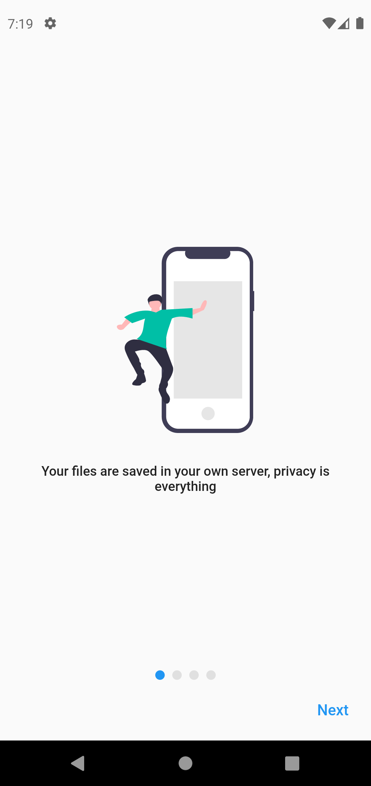
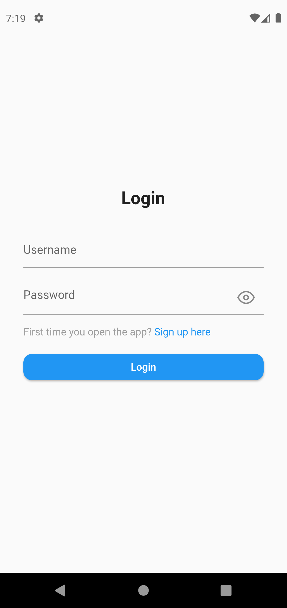
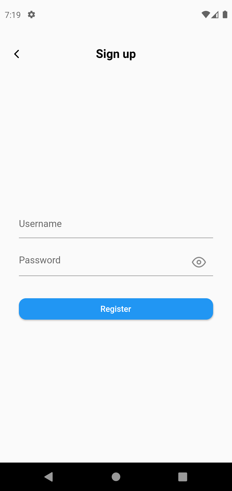
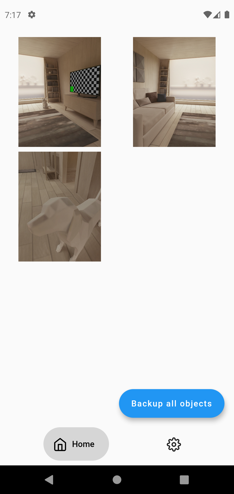
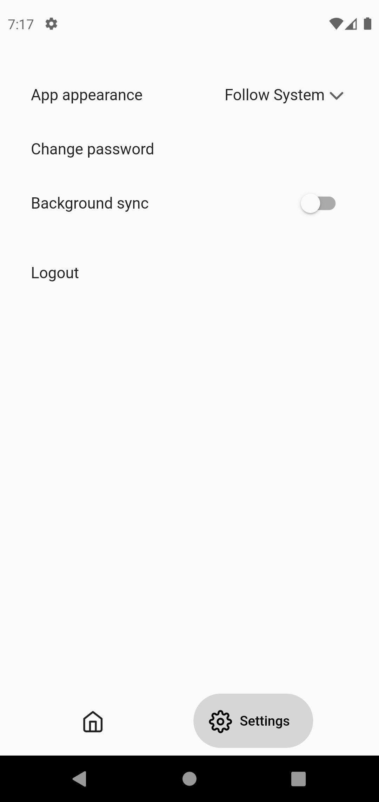

# PhotoSync
## What is PhotoSync_app?

This is the app for the [PhotoSync api](https://github.com/leopi99/photoSync_api).

## Not stable for "production" this is still in beta, everything can change
Current version: 0.6.0

## Some screenshots

## Features

- [ ] Background media syncronization [TODO]
- [x] Download your syncronized media from the api
- [x] Backup your media files in your server (using [PhotoSync api](https://github.com/leopi99/photoSync_api))
- [x] Dark theme (needs some work on colors)

## Hot to setup the app

There is not much to do (except some work on the features and bugs...), if you don't like the default values for the api (object_repository.dart) you can change the base endpoint path.

## Why PhotoSync?
Since the popular Google photo have dropped the unlimited storage, I thougth to create this to have the storage size when I want
